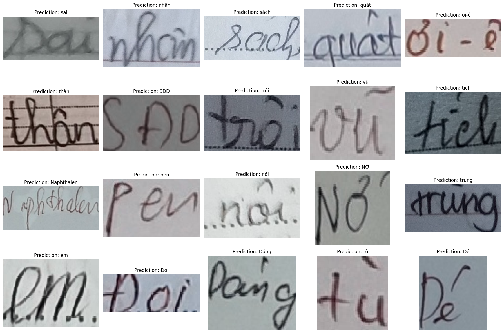

# Vietnamese Handwriting Recognition

This repository is our work for project of course IT3320E - Introduction to Deep Learning - Semester 2023.1 in Hanoi University of Science and Technology. Vietnamese Handwriting Recognition is a popular and necessary track in AI-based products of industry. Our solution contains 3 main stages:
- **Feature extraction**: Extract visual feature from input handwritten character image to get regional feature.
- **Sequence modelling**: Since previous feature is regional and lack of sequentiality, which is neccessary for text recogntion task. We model those local feature into a sequence using Bidirectional LSTM and fully collect the data of image from left to right, top to bottom and vice versa, intuitively
- **Prediction and decoder**: After get sequential feature, in order to increase the aggregation between layers, we use attention mechanism. At the decoding stage, we use LSTM to follow the only-look-back property of each Vietnames word, which actually a sequence of character


## How to train
In order to train Res-Bi-Attn via our pipeline, setup configuration on the bash file [here](./scripts/). The `train` and `infer` folders are which can be used for training and inference. Another folder named `train_wandb` is for our training using our own key, which is unavailable publicly. However, it simply add wandb key into the `train.py` python script. For quick test, run:
```bash
CUDA_VISIBLE_DEVICES=0 bash scripts/train/baseline_1.sh
```
- The output of training will be stored in [here](./outputs/), in `args.task` folder (adjust this in configuration file bash)
- Training dataset shoule be in the following format:
```
data
|- new_train
    |- image1.jpg
    |- ...
|- train_list.txt
|- val_list.txt
```

## For inference
- The infererence script can be found from [here](./infer.py)
```bash
CUDA_VISIBLE_DEVICES=0 bash scripts/infer/infer_1.sh
```
- For visual demonstration, refer to this [notebook](./demo.ipynb)



## Evaluation
- For evaluation, we use Character Error Rate (CER) for metrics, which is conventional metric in text recognition text generally. The CER for our best model currently is 0.58, which is a significant performance for the baseline mode.


## References:
- Spatial Transformer Networks: [link](https://arxiv.org/abs/1506.02025)
- ResNet extractor: [link](https://arxiv.org/abs/1512.03385)
- LSTM and Bidirectional LSTM: [link](https://arxiv.org/abs/1402.1128)
- Attention mechanism:
- Reference Repo: [clovaai](https://github.com/clovaai/deep-text-recognition-benchmark/tree/master)

